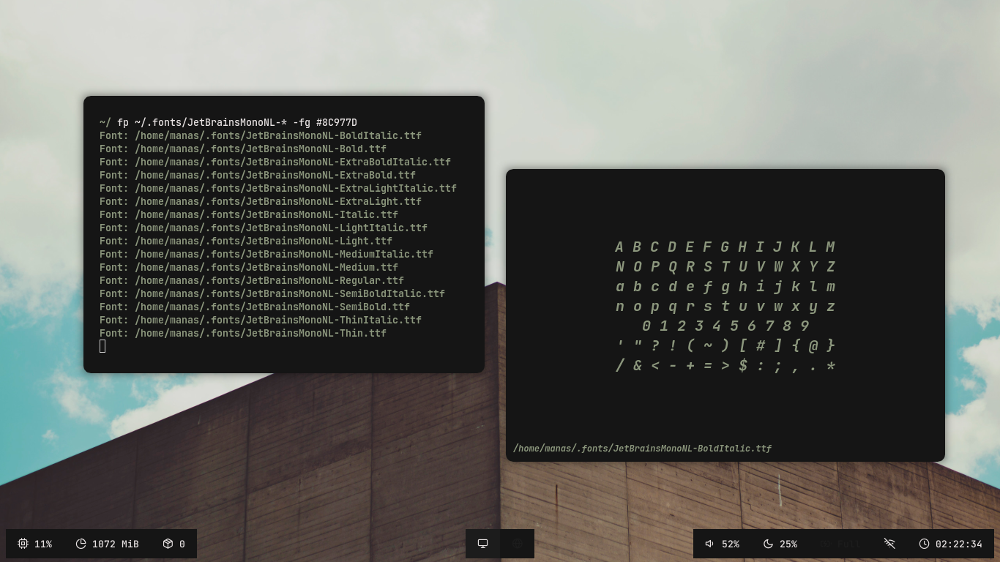

# Font Preview
A Simple Customizable FontPreview Sh Script.
<p align="center">
  
</p>

# Dependencies
```
  ImageMagick
```

# Install
```
  git clone https://github.com/Manas140/FP.git && cd FP
  ./install.sh i
```

# Usage
```
Usage: fp -[fs|fg|bg|ws|pt|lf|lb|rf|rb|iv|h] font_path
   -h: help
  -fs: font size.
  -fg: foreground color.
  -bg: background color.
  -ws: window size.
  -pt: preview text.
  -lf: linear foreground gradient.
  -lb: linear background gradient.
  -rf: radial foreground gradient.
  -rb: radial background gradient.
  -iv: image viewer.
```

# Example
```
  fp ~/.fonts/ComicNeue-Bold.ttf -fs 25 -lb SlateBlue3-IndianRed1 -fg snow1
```
